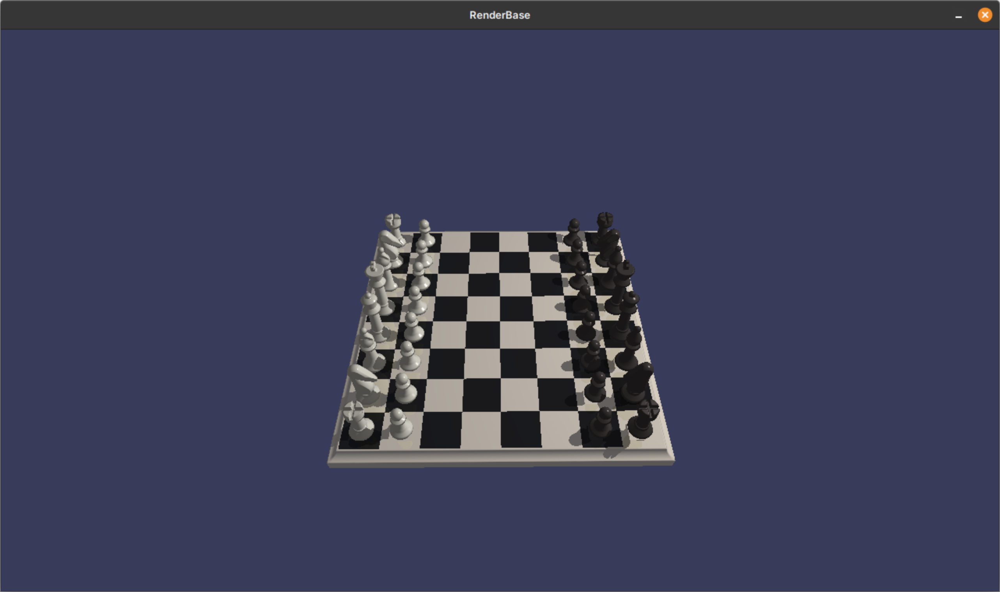
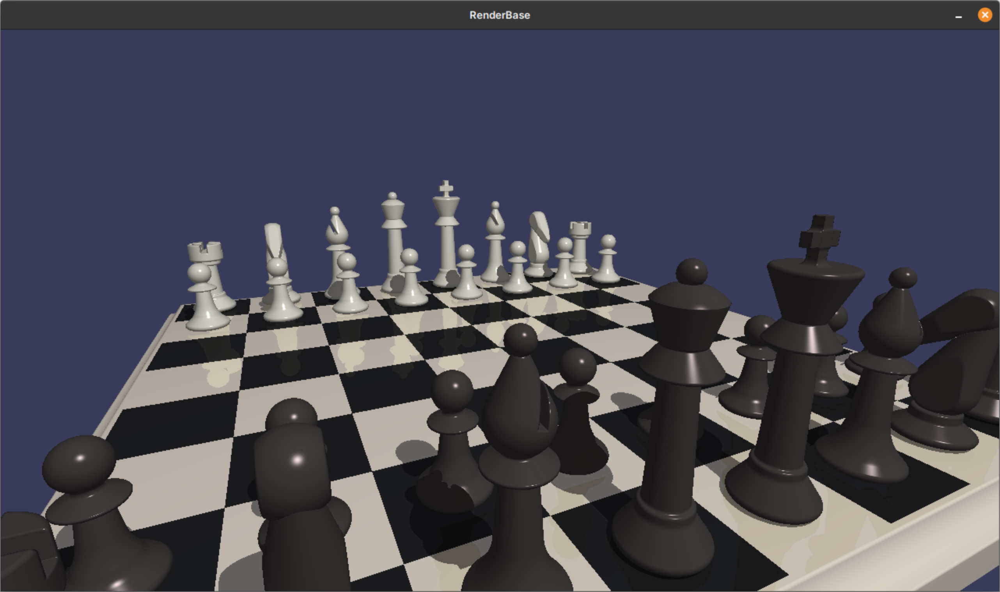
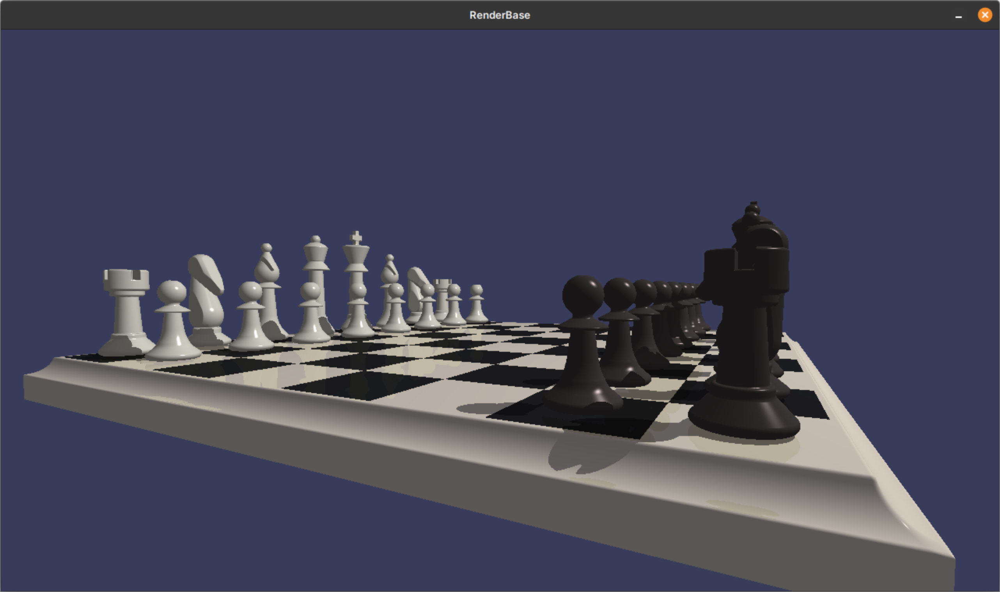

# PRGChess

This repo contains a finished project to "Computer graphics" course at

Brno University
Of Technology - Faculty Of InformationTechnology.

This project is a simple scene renderer that visualizes a chessboard made up of Constructive Solid Geometry models using SDF primitives.

Scene is loaded from resources/scene.json file.

The rendering process uses a screen quad and a per-pixel raymarching algorithm in the fragment shader, utilizing techniques inspired by the informative blog of Inigo Quilez:

https://iquilezles.org/articles/

## Installation and Running

### Prerequisites

- CMake 3.18 or newer
- C++ compiler with C++17 support
- OpenGL 4.3 or newer

### Cloning repo
*Repository contains all dependencies as submodules.*

```bash
git clone https://github.com/xfusek08/PRGChess.git --recursive
```

### Debug build

```bash
mkdir build && cd build
cmake -DCMAKE_BUILD_TYPE=Debug ..
make -j
```

### Release build

```bash
mkdir build && cd build
cmake -DCMAKE_BUILD_TYPE=Release ..
make -j
```

### Run the app

```bash
./PRGChess
```

**NOTE:** For binary distribution make sure that it is compiled in `Release` mode and that `resources` folder is in the same directory as the binary.

## Controls
Rotating with mouse while holding left mouse button.

## Documentation
[PGR-doc-xfusek08.pdf](doc/PGR-doc-xfusek08.pdf) (czech only)

Despite low self-evaluation full 30/30 points were awarded 😉.

## Screenshots





## Authors
[Petr Fusek](https://github.com/xfusek08)

## Thank to and credits

- [glm](https://github.com/g-truc/glm)
- [json](https://github.com/nlohmann/json)
- [glad](https://glad.dav1d.de)
- [sdl](https://www.libsdl.org/)
